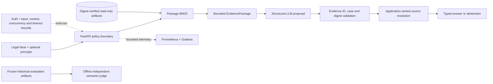

# Precedent SG RAG

A production-oriented RAG system for Singapore legal-precedent retrieval, built around measured
retrieval, explicit abstention, deterministic citation integrity, and application-owned sources.

**Python · FastAPI · passage BM25 · structured LLM output · Docker · Prometheus · Grafana · CI**

- Full-corpus BM25 Recall@10 improved from **1.7% to 20.2%** after repairing semantically weak
  candidate representations with leakage-safe historical citation passages.
- Answers and abstentions use typed contracts: the model proposes evidence references, while the
  application validates them and resolves the exact source text.
- A non-root, read-only-capable Docker service loads digest-verified persistent retrieval artifacts;
  Prometheus/Grafana telemetry, API authentication, bounded provider use, and adversarial tests are
  part of the repository.
- Evaluation is treated as an engineering system. Clean-room adjudication, citation audits, and an
  independent non-OpenAI semantic judge exposed label leakage, evaluator brittleness, and judge bias.

This is a portfolio and evaluation project, not legal advice or a claim of production legal
reliability. It uses the public, CC BY 4.0
[SG-LegalCite](https://huggingface.co/datasets/anonymousmeowmeow/SG-LegalCite) dataset.

## Why this project exists

Legal-precedent RAG needs more than a plausible answer. It needs relevant evidence, a defensible
answer/abstention boundary, citation integrity, provenance, and reproducible evaluation.

The initial lexical, dense, hybrid, and cross-encoder experiments remained weak because the
released candidates were mostly case names or citations. Queries contained facts and legal
principles, but candidate text often contained no comparable meaning. Adding an LLM on top would
have hidden that retrieval failure. Precedent instead repaired the candidate representation using
bounded historical citation-context passages available before the 2024–2025 test period.

## 20-second architecture



Retrieval is independently usable without model credentials. The semantic judge is an out-of-band
QA experiment; it is not on the request path and cannot relax deterministic enforcement.

## Key engineering results

### Retrieval repair

These are exact full-corpus results on the 2024–2025 temporal test split for combined
facts-plus-principle queries. They are not production legal-quality estimates.

| Candidate representation | Cohort | Queries | MRR | Recall@10 | Recall@50 |
| --- | --- | ---: | ---: | ---: | ---: |
| Identifier BM25 | All test queries | 8,057 | 1.196% | 1.696% | 1.988% |
| Historical-passage BM25 | All test queries | 8,057 | 12.517% | 20.195% | 30.932% |
| Historical-passage BM25 | Warm-start only | 5,354 | 18.837% | 32.328% | 49.642% |

Warm-start means the target had usable pre-2024 historical citation context. About half of unique
test targets remain cold-start, so the warm row must not be presented as overall performance. BM25
also outperformed the tested BGE-small passage retriever on the main combined task. See the
[corpus-repair protocol and full matrix](docs/corpus_repair.md) and preserved
[result artifact](experiments/results/corpus_repair_passages_bm25.json).

### Persistent runtime

Measured on the development host with the complete pinned corpus:

| Runtime measurement | Result |
| --- | ---: |
| Removed first-request corpus + BM25 reconstruction | 46.697 s |
| Standalone verified artifact load | 2.478 s |
| Cold process to retrieval-ready | 2.913 s |

The explicit build is slower than loading because it verifies, constructs, serializes, and
self-validates the bundle. Repeated builds produced the same manifest digest; requests never rebuild
the corpus or index. See [deployment and artifact measurements](docs/deployment.md).

## Grounded citation design

The production contract deliberately separates model judgment from source authority:

> **LLM proposes evidence references; application owns source text.**

A structured answer contains `status`, a bounded explanation, a recommended `case_id`, and atomic
claims referencing `evidence_id` plus `case_id`. The application then rejects unknown or invisible
evidence, case/evidence mismatches, unsupplied recommendations, invalid answer/abstention shapes, and
changed passage digests. Only after every check passes does it attach the exact stored passage and
provenance to the typed response.

This proves referential integrity and traceability—not semantic entailment or legal correctness.
The design replaces brittle model-generated quotations without rewriting the preserved historical
evaluation. See the [production citation contract](docs/production_citation_contract.md).

## API and Docker quick start

Python 3.11 or newer and [uv](https://docs.astral.sh/uv/) are recommended. Building the complete
retrieval bundle requires the pinned dataset and temporal split and downloads about 764 MB.

```bash
uv sync --locked --extra dev --extra generation --extra api
uv run sg-legal-download
uv run sg-legal-validate --output reports/dataset_validation.json
uv run sg-legal-split --strategy temporal --output data/processed/splits_temporal.csv
uv run sg-legal-build-retrieval-artifacts

export PRECEDENT_API_KEY='replace-with-a-distinct-service-secret'
export PRECEDENT_METRICS_KEY='replace-with-a-distinct-metrics-secret'
docker compose up --build
```

Then inspect `http://127.0.0.1:8000/docs`, or call the service directly:

```bash
curl http://127.0.0.1:8000/health
curl http://127.0.0.1:8000/ready
curl --header "X-Precedent-API-Key: $PRECEDENT_API_KEY" \
  --header 'Content-Type: application/json' \
  --data '{"facts":"When can a director be personally liable for a company contract?","top_k":3}' \
  http://127.0.0.1:8000/retrieve
```

`/retrieve` needs no model credential. `/answer` additionally requires `OPENAI_API_KEY`; service
startup, health, readiness, version, retrieval, and metrics never call a model provider. Endpoint,
configuration, and error contracts are documented in [the API guide](docs/api.md).

## Evaluation as engineering

The project keeps operational failure, retrieval identity, evidence sufficiency, generation
behavior, citation validity, and semantic support as separate layers. Several initially reasonable
evaluation assumptions failed under audit:

| Discovered problem | Engineering response |
| --- | --- |
| Correct case identity did not imply that the visible passage could answer the query | Separated `target_present` from manually reviewed evidence sufficiency |
| “Answerable” was ambiguous when evidence stated a rule but did not resolve the user's facts | Versioned the rule: answer with explicit limitations when the supplied rule is useful; abstain on absent, unrelated, ambiguous, or weak evidence |
| Hidden retrieval/citation metadata influenced reference labels | Re-adjudicated the unchanged 12-record pilot in a context-isolated clean room using only model-visible material |
| Mojibake made four of 14 grounded claims look uncited | Preserved strict results and added a separately reported, deterministic encoding-normalized audit |
| Requiring generated verbatim quotations conflated traceability with copying behavior | Moved production citations to validated evidence IDs and application-owned text |
| The independent judge preferred `supported` and missed whole-answer relevance defects | Kept it diagnostic and out of band rather than treating LLM-as-judge output as ground truth |

The clean-room behavioral pilot measured 72.2% balanced accuracy on 12 deliberately selected
records (TP 7, TN 2, FP 1, FN 2). That small engineered pilot tests failure modes; it does not
estimate production prevalence. The frozen protocols, results, and limitations are in the
[generation evaluation report](docs/rag_baseline.md).

## Production reliability

- Typed health, readiness, version, retrieval, answer, and safe error responses.
- Immutable retrieval bundles with manifest, compressed-file, decompressed-payload, passage, and
  BM25 structural verification; missing or corrupt artifacts fail closed and are never rebuilt.
- Reproducible build timestamps and frozen configuration/source hashes.
- Numeric non-root container user `10001:10001`, read-only root filesystem, dropped capabilities,
  and separately mounted read-only artifacts.
- GitHub Actions gates dependency auditing, lint, formatting, tests, image construction, non-root
  execution, read-only artifact access, authentication, readiness, metrics, and retrieval smoke tests.
- Provider timeouts and zero automatic retries avoid hidden duplicate calls.

The Docker image contains code and locked dependencies, but no dataset, retrieval bundle,
credentials, private notes, or experiment results.

## Observability

`GET /metrics` exposes bounded-label Prometheus metrics for HTTP and RAG operation counts, phase and
provider latency, retrieval result counts, answer/abstention outcomes, failure categories, citation
violations, token usage, estimated provider cost, readiness, and artifact load state.

Structured logs and metrics omit query, prompt, evidence, model-response, credential, case-name,
and passage-digest content. A datasource-agnostic
[Grafana dashboard](observability/grafana-dashboard.json) and example PromQL are included; no claim
is made that monitoring infrastructure is deployed. See [observability](docs/observability.md).

## Security and abuse resistance

The client query, retrieved legal text, and provider output are all untrusted data. The application,
not the LLM, enforces the boundary.

| Surface | Default access policy |
| --- | --- |
| `/health`, `/ready`, `/version` | Public bounded operational state |
| `/docs`, `/openapi.json` | Public for the demo; disable with `ENABLE_DOCS=false` |
| `/retrieve`, `/answer` | Separate `X-Precedent-API-Key` service credential |
| `/metrics` | Separate metrics credential; intended for internal network placement |

Controls include constant-time credential checks, fail-closed configuration, trusted-host
allow-listing, disabled CORS, bounded characters/top-k/context/output, non-queuing generation
concurrency, provider timeout, zero automatic retries, strict output validation, artifact symlink
rejection, dependency scanning, and adversarial prompt/evidence/output fixtures. Prompt isolation is
defense-in-depth, not proof that injection is impossible. See the [threat model](docs/security.md).

## Independent semantic QA

An offline Gemini Free Tier pilot used a separate provider family to judge frozen public/licensed
historical outputs. The final run produced four valid verdicts before a fifth provider interaction
returned incomplete and triggered fail-fast; the remaining three records were not called.

- Record-level agreement: **50% on four evaluated records**; all four judge verdicts were
  `supported`, including two reference-unsupported records.
- Claim-level agreement: **100% on seven evaluated supported claims**; no unsupported reference
  claims were reached at claim level.
- Manual disagreement review found useful narrow claim grounding but supported-label bias and weak
  discrimination of whole-answer relevance and recommended-authority defects.

The independent judge is therefore useful as a shadow QA signal, but it is diagnostic—not reliable
ground truth or a production trust boundary. See the [judge design](docs/semantic_judge.md) and
[final pilot artifact](experiments/results/semantic_judge_pilot_gemini_3_5_1800_60s.json).

## Repository guide

| Path | Purpose |
| --- | --- |
| `src/sg_legal_rag/ingestion/` | Pinned download, validation, and split policy |
| `src/sg_legal_rag/retrieval/` | BM25, dense, hybrid, reranking, corpus repair, and persistent artifacts |
| `src/sg_legal_rag/generation/` | Frozen evaluation, structured generation, citation validation, and semantic QA |
| `src/sg_legal_rag/api/` | FastAPI contracts, service boundary, security, and telemetry |
| `configs/` | Versioned experiment and runtime inputs |
| `experiments/` | Frozen samples and machine-readable results |
| `tests/` | Offline unit, integration, artifact, API, and adversarial regressions |
| `docs/` | Protocols, decisions, measurements, threat model, and residual risks |

Focused documentation:

- [Dataset provenance and split policy](docs/dataset.md)
- [Lexical baseline](docs/retrieval_baseline.md), [dense comparison](docs/dense_baseline.md),
  [hybrid experiment](docs/hybrid_baseline.md), and [reranking ablation](docs/reranker_baseline.md)
- [Leakage-safe corpus repair](docs/corpus_repair.md) and
  [grounded-generation evaluation](docs/rag_baseline.md)
- [Citation contract](docs/production_citation_contract.md), [API](docs/api.md), and
  [deployment/reproducibility](docs/deployment.md)
- [Observability](docs/observability.md), [security](docs/security.md), and
  [independent semantic QA](docs/semantic_judge.md)

## Limitations

- Retrieval remains incomplete: roughly half of unique temporal-test targets have no usable
  pre-2024 citation context, and even warm-start Recall@50 remains below 50%.
- Historical citation contexts are secondary descriptions, not authoritative substitutes for full
  judgments; conservative identity matching leaves likely aliases unresolved.
- Generation, abstention, and independent-judge pilots are small diagnostic samples, not statistical
  evidence of legal reliability or real-world prevalence.
- Deterministic citation controls prove provenance and integrity, not semantic entailment.
- The semantic judge showed supported-label bias and did not evaluate unsupported reference claims
  at claim level in the final run.
- Authentication and concurrency are process-local service controls, not end-user identity,
  distributed rate limiting, DDoS protection, or a billing cutoff.
- Public/licensed evaluation material only may be submitted to providers. The system is not legal
  advice and makes no claim of production legal reliability.

## Reproducibility

Dataset revision, split policy, model revisions, prompts, schemas, evidence packages, configurations,
reference adjudications, and result artifacts are versioned or content-addressed. Expensive
experiments use restart-safe caches; committed result JSON remains the auditable record.

For the complete workflow, start with [data provenance](data/README.md), then follow the focused
retrieval and evaluation documents above. Offline verification requires no provider calls:

```bash
uv sync --locked --extra dev --extra generation --extra api --extra judge
uv run sg-legal-semantic-judge --preflight
uv run pytest
```

Project code is MIT licensed. Dataset material remains under its upstream CC BY 4.0 licence; the
project licence does not relicense the dataset or source judgments.

## Portfolio summary

Precedent demonstrates the full reasoning loop behind a production-oriented RAG system: benchmark
retrieval before generation, repair the representation rather than hide weak retrieval, enforce
grounding and provenance in application code, deploy reproducible read-only artifacts, instrument
and secure the service boundary, and audit the evaluators themselves.
